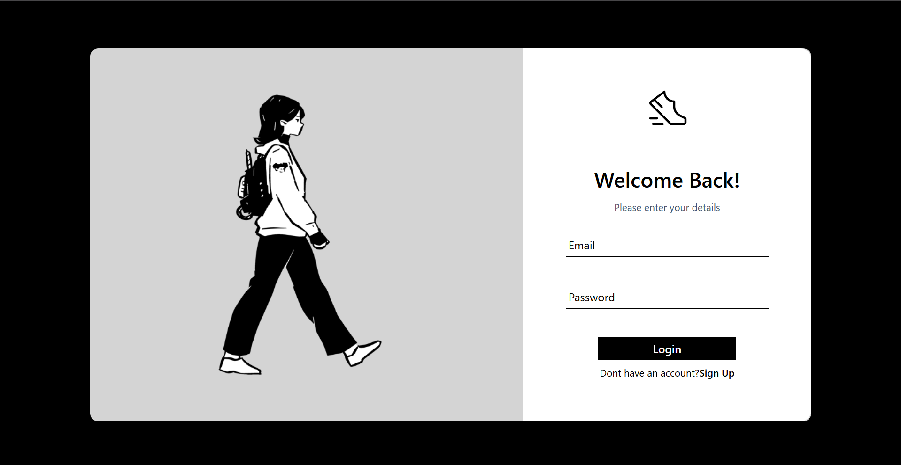
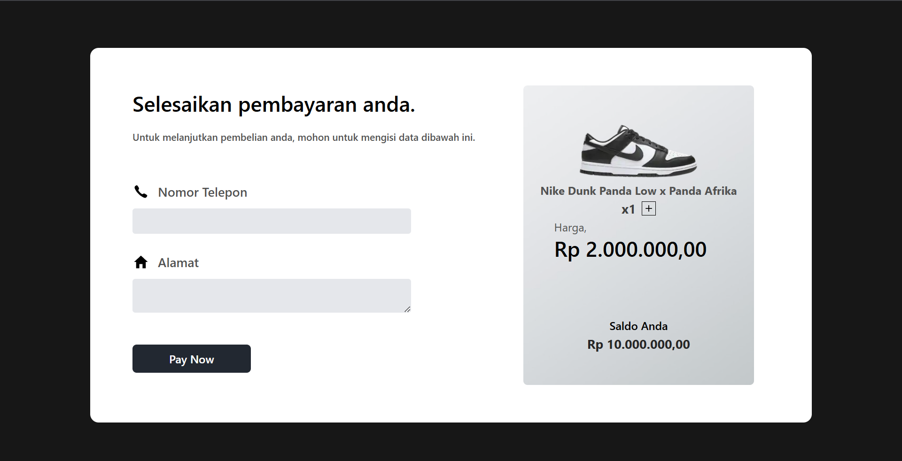
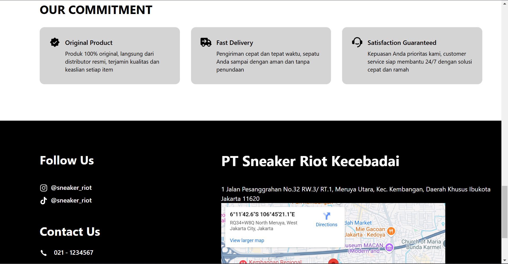
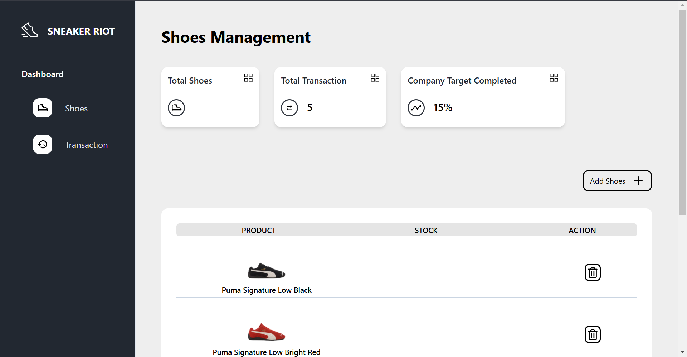

# WEBSITE E-COMMERCE SNEAKERS SEDERHANA
( Untuk penjelasan lebih detail tentang sistem nya bisa di cek di folder BACKEND )
## Teknologi yang digunakan
1. `React`
2. `Tailwind CSS`
3. `Axios`
4. `React Icon`
5. `React-Router-DOM`
6. `React-Countdown`

## Tampilan Website
- **Register**

- **Login**

- **Account**

- **Main Page**

- **Main Page(2)**

- **Main Page(3)**

- **Checkout**

- **Invoice**

- **Map**

- **Shoes Dashboard**

- **Transaction History Dashboard**

